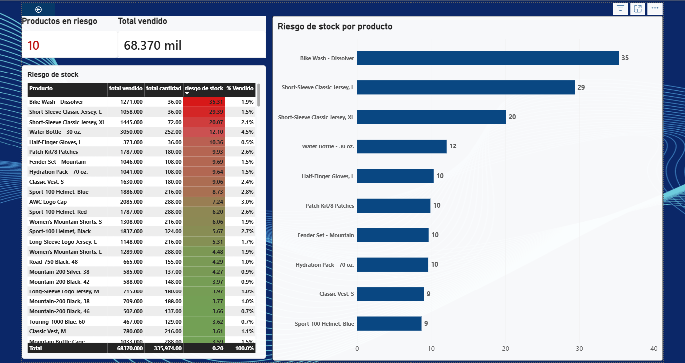
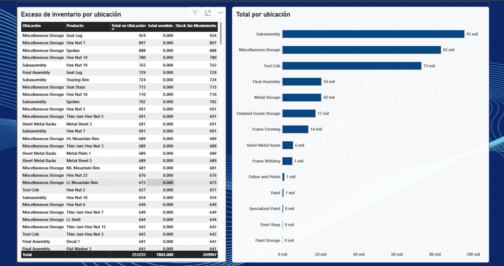
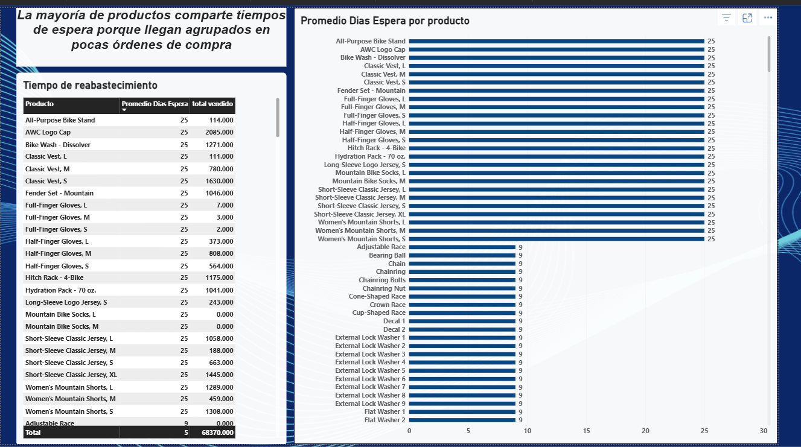

# Análisis de Riesgo de Inventario — AdventureWorks

Proyecto de portafolio de análisis de datos que responde tres preguntas de negocio sobre gestión de inventario, usando el flujo completo **SQL Server → Power Query → Power Pivot → Power BI**.

## Contexto

Un encargado de operaciones necesita identificar:
1. **¿Qué productos tienen mayor riesgo de quedarse sin stock?**
2. **¿Qué ubicaciones tienen exceso de inventario sin movimiento?**
3. **¿Qué tan rápido se está reabasteciendo desde los proveedores?**

## Fuente de datos

Base de datos de ejemplo **AdventureWorks2025** en SQL Server (esquemas `Production`, `Sales`, `Purchasing`, `Person`).

## Herramientas y flujo

- **SQL Server** — extracción y agregación de datos (JOINs, subconsultas, funciones de fecha, GROUP BY/HAVING)
- **Power Query** — conexión directa a SQL Server, limpieza (tipos de dato, nulos, texto)
- **Power Pivot** — modelo de datos en esquema de estrella, medidas DAX (SUM, DIVIDE, CALCULATE, ALL, FILTER)
- **Power BI** — dashboard interactivo con 3 hojas, una por pregunta de negocio

## Metodología

Todas las métricas de ventas y compras se calculan sobre una ventana móvil de **6 meses** (no el histórico completo), para reflejar la demanda y el desempeño de proveedores más recientes en vez de datos acumulados desde el origen de la base.

## Modelo de datos

Esquema de estrella con 6 tablas:

| Tabla | Rol | Se relaciona con |
|---|---|---|
| `muestra` | Dimensión: producto | Centro del modelo |
| `Ubicaciones` | Dimensión: bodega | `Stock por ubicación` |
| `Total_ventas` | Hechos: ventas últimos 6 meses | `muestra` |
| `Total_cantidad` | Hechos: stock total actual | `muestra` |
| `Stock por ubicación` | Hechos: stock por bodega | `muestra`, `Ubicaciones` |
| `Reabastecimiento` | Hechos: días de espera por producto | `muestra` |

## Consultas SQL principales

<details>
<summary>Ver consultas</summary>

**Ventas recientes (6 meses) por producto**
```sql
SELECT 
    productID_name.ProductID,
    productID_name.Name,
    SUM(ventas_recientes.OrderQty) AS salesorder_qty
FROM Production.Product AS productID_name
LEFT JOIN (
    SELECT sales_order.ProductID, sales_order.OrderQty
    FROM Sales.SalesOrderDetail AS sales_order
    JOIN Sales.SalesOrderHeader AS date
        ON sales_order.SalesOrderID = date.SalesOrderID
    WHERE date.OrderDate >= '2024-12-29'
) AS ventas_recientes
    ON ventas_recientes.ProductID = productID_name.ProductID
GROUP BY productID_name.ProductID, productID_name.Name;
```

**Stock por producto y ubicación**
```sql
SELECT ProductID, LocationID, SUM(Quantity) AS total_Location
FROM Production.ProductInventory
GROUP BY ProductID, LocationID;
```

**Reabastecimiento por proveedor (últimos 6 meses)**
```sql
SELECT
    vendor.Name AS Proveedor,
    AVG(DATEDIFF(DAY, header.OrderDate, header.ShipDate)) AS PromedioDiasEspera,
    COUNT(*) AS TotalOrdenes
FROM Purchasing.PurchaseOrderHeader AS header
JOIN Purchasing.Vendor AS vendor
    ON header.VendorID = vendor.BusinessEntityID
WHERE header.OrderDate >= '2025-03-21'
GROUP BY vendor.Name;
```

</details>

## Medidas DAX clave

```dax
riesgo de stock := DIVIDE([total vendido], [total cantidad], BLANK())
% Vendido := DIVIDE([total vendido], CALCULATE([total vendido], ALL(muestra)), 0)
Productos en Riesgo := CALCULATE(COUNTROWS(muestra), FILTER(muestra, [riesgo de stock] > 5))
```

## Hallazgos principales

1. **Riesgo de quiebre:** un grupo pequeño de productos concentra una relación venta/stock muy alta (hasta 35x), priorizando qué reabastecer primero.
2. **Exceso de inventario:** varias bodegas (especialmente *Miscellaneous Storage* y *Subassembly*) acumulan stock alto en productos con cero ventas recientes.
3. **Reabastecimiento:** el tiempo de espera varía más por producto que se agrupa en pocas órdenes de compra grandes; al analizar por proveedor se revela mejor la variación real en tiempos de entrega.





## Autor

Geremy Jiménez 
